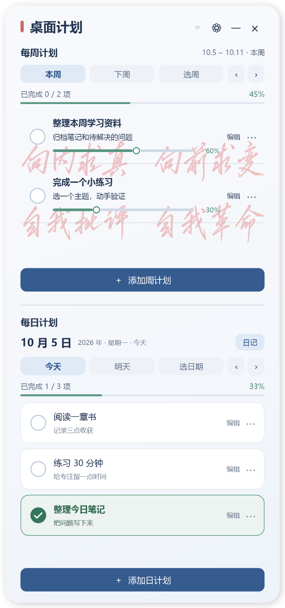
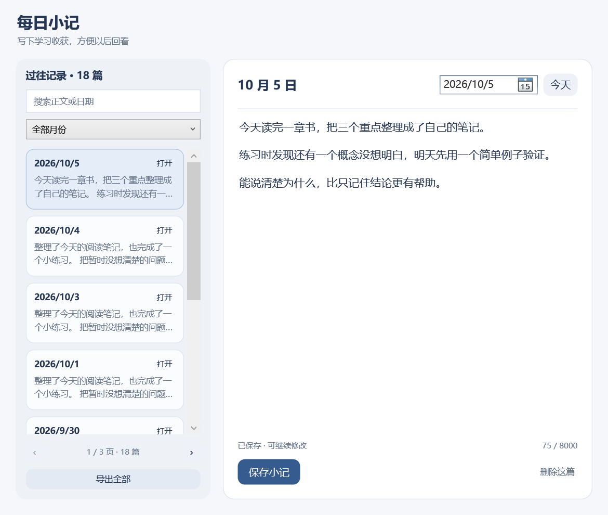

# DeskPlanner · 桌面计划

一个轻量的 Windows 桌面小组件，把每周计划、每日安排和学习小记放在一起。

- 周任务可调整进度，日任务可勾选完成。
- 日记支持搜索、按月查看和导出。
- 支持自定义标题、背景、透明度和登录自启动。

## 预览

查看日记页面

*演示图使用虚构内容。*

## 下载使用

前往 [最新版本](https://github.com/XAUNZIUH/Desk-Planner/releases/latest) 下载 Windows ZIP，解压后双击 `DeskPlanner.exe`。

适用于 Windows 10 / 11（需要 .NET Framework 4.x）。计划和日记保存在程序旁的 `data/` 文件夹，可离线使用，不会上传到 GitHub。更新时保留这个文件夹。

[使用说明](docs/USAGE.md) · [备份与迁移](docs/DATA.md) · [开发说明](docs/DEVELOPMENT.md)
